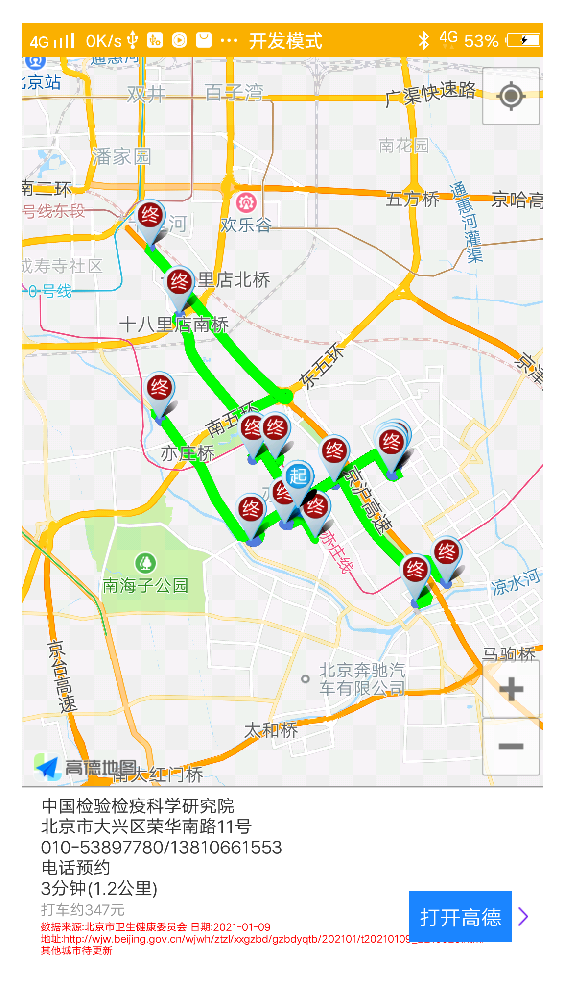

<p align="center"> <font size="16" face="Verdana">查找距离最近的核酸检测地址 [仅支持北京]</font></p>


过节需要做核酸，不知道哪个点距离近

就做了个工具检测，查找距离最近的核酸检测地址，后续看有没有事件待优化填坑

貌似做成小程序 裂变效果会好一些

核酸检测算是个测试吧，可以扩展其他便民服务，主要是显示路程最近和路线全部画到地图上，列表模式，感觉不够直接

原理：

1. 查找官方数据文件

2. 数据文件一般为地址，通过高德做地理编码，转换为经纬度（其实貌似可以不做编码也可以导航，暂时没尝试）

3. 定位，地址导航，排序，找车程最短的前15和地址，画图，展示

   (导航目前是当前城市所有都导航，目的地太多，待优化，行政区域划分，地理围栏等，导航需要消耗api配额)

核酸检测机构数据来源 如下

- [北京]  252所
  - 数据来源:北京市卫生健康委员会 日期:2021-01-09"
  - 网页地址:http://wjw.beijing.gov.cn/wjwh/ztzl/xxgzbd/gzbdyqtb/202101/t20210109_2210023.html


### 2021.02.04 16:02:41

- 北京核酸地址 经纬度导入完毕

- 打开自动定位，查询所有检测地，显示路线最近的15条路线

  点击地点，显示地点名称和备注

- 底部增加数据来源提示

  

  

  

  

### 2021.02.04 16:02:36

- #### 签名
    mapmarks.jks
    octopus
    123321

- #### 高德地图key申请

2021.02.04 16:02:18立项

- ```java
com.octopus.mapmarks
  ```
  
  
